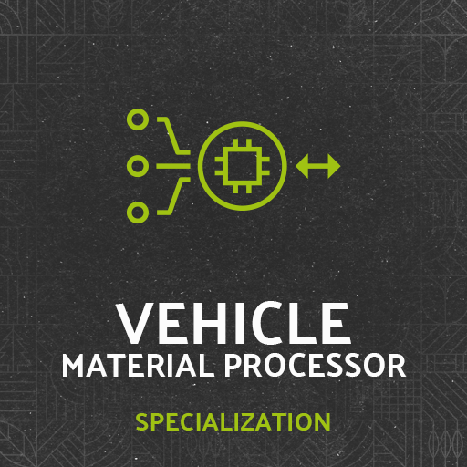

# Material Processor

Vehicle specialization for processing material inputs and outputs.

```
author: scfmod
url:    https://github.com/scfmod/FS25_MaterialProcessor

If you distribute this mod, always include this info.

AND DO NOT UPLOAD IT TO MONETARY UPLOAD SERVICES.
THIS CODE IS AVAILABLE TO ANYONE FOR FREE AND YOU CAN USE
IT TO LEARN, FORK AND SPREAD THE KNOWLEDGE.
```

## How to download and install

Download the latest [```FS25_0_MaterialProcessor.zip```](https://github.com/scfmod/FS25_MaterialProcessor/releases/latest/download/FS25_0_MaterialProcessor.zip) and copy/move it into your FS25 mods folder.

## Multiplayer

Multiplayer is fully supported.

## Documentation

For implementation details and examples: [docs/INDEX.md](./docs/INDEX.md)