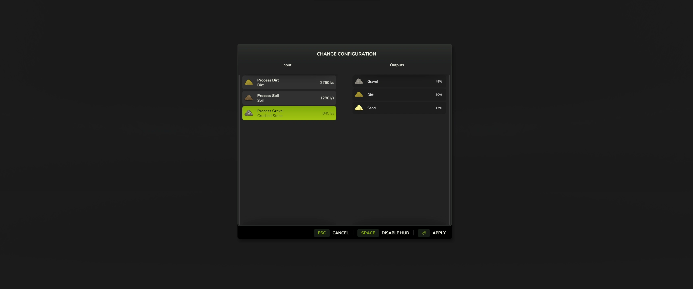

# Material Processor

Vehicle specialization for processing material inputs and outputs. This is a mod for enabling new features for other modders to utilize.

```
author: scfmod
url:    https://github.com/scfmod/FS25_MaterialProcessor

If you distribute this mod, always include this info.

AND DO NOT UPLOAD IT TO MONETARY UPLOAD SERVICES.
THIS CODE IS AVAILABLE TO ANYONE FOR FREE AND YOU CAN USE
IT TO LEARN, FORK AND SPREAD THE KNOWLEDGE.
```

## Vehicle Specializations

### MaterialProcessor

Specialization that adds functionality for processing input filltype(s) into output filltype(s). Vehicles can also discharge from multiple FillUnits simultaneously using custom discharge nodes. Multiple configurations can be set up in XML and changed using in-game GUI.



For implementation details and examples: [docs/INDEX.md](./docs/INDEX.md)

### FillUnitExtension

Utilize additional features for base game FillUnit specialization, enabling playing sound effects and toggling object changes based on fill level.

For implementation details and examples: [docs/FILLUNIT_EXTENSION.md](./docs/FILLUNIT_EXTENSION.md)

## How to download and install

Download the latest [```FS25_0_MaterialProcessor.zip```](https://github.com/scfmod/FS25_MaterialProcessor/releases/latest/download/FS25_0_MaterialProcessor.zip) and copy/move it into your FS25 mods folder.

## Multiplayer

Multiplayer is fully supported.
